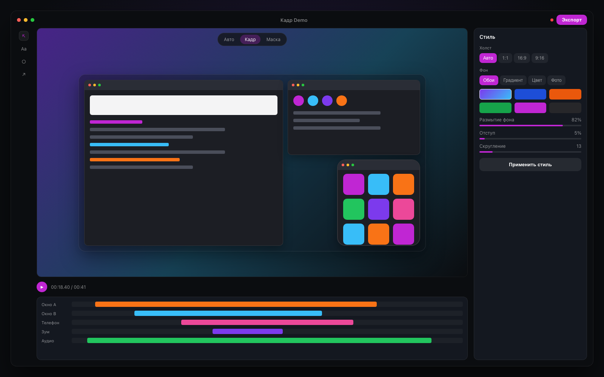
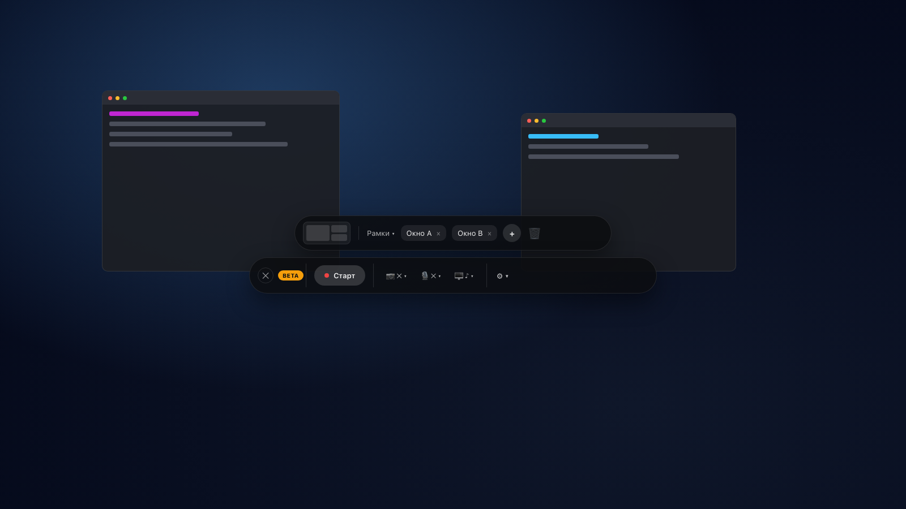
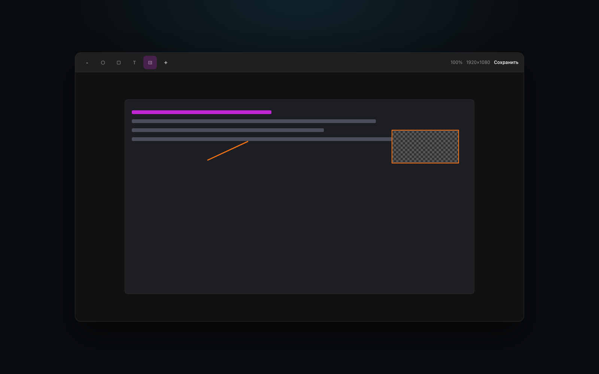

# Щёлк.Кадр

Скриншоты и запись экрана для Mac в одном приложении. Несколько окон — в одном кадре.

  <a href="https://therealzelensky.github.io/SnapKadr/"><strong>Сайт</strong></a>
  ·
  <a href="https://therealzelensky.github.io/SnapKadr/#download"><strong>Скачать бету</strong></a>
  ·
  <a href="https://github.com/Therealzelensky/SnapKadr/releases">Releases</a>

  

## Одно приложение. Два инструмента.

**Щёлк** — снимки и пометки. **Кадр** — запись и сборка ролика. Без прыжков между программами.

### Кадр — запись экрана

- Несколько окон в одном кадре — приложение рядом с браузером, терминалом или телефоном
- Сначала раскладка, потом запись
- Телефон (Continuity) и камера в том же ролике
- Монтаж: таймлайн, автозум, курсор, маски, субтитры
- Экспорт MP4 / GIF под 16:9, 1:1 или 9:16

  

### Щёлк — скриншоты

- Область, окно или весь экран
- Пометки сразу после снимка
- Длинная страница целиком
- Текст и QR со скрина — локально на Mac
- Снимок поверх окон и фон рабочего стола

  

## Скачать

Бета для macOS 14+: [скачать с сайта](https://therealzelensky.github.io/SnapKadr/#download) или открыть [GitHub Releases](https://github.com/Therealzelensky/SnapKadr/releases).

После установки обновления приходят через Sparkle прямо в приложении.

## Ссылки

- [Лендинг](https://therealzelensky.github.io/SnapKadr/)
- [Обратная связь](https://github.com/Therealzelensky/app-feedback)
- [Каналы релизов](./CHANNELS.md)
